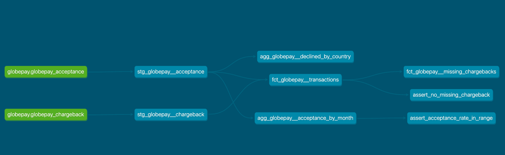

# Deel Data Engineering Challenge
> dbt + Snowflake · Globepay Acceptance and Chargeback Reports

---

## Overview

This project transforms raw Globepay payment data into a clean, analytics-ready layer using **dbt** with **Snowflake as the data warehouse**. It answers three business questions:

1. **What is the acceptance rate over time?**
2. **Which countries had declined transaction volumes exceeding $25M?**
3. **Which transactions are missing chargeback data?**

---

## Preliminary Data Exploration

Data originates from the **Globepay Payments API** and lands in two raw Snowflake tables: `GLOBEPAY_ACCEPTANCE` and `GLOBEPAY_CHARGEBACK`, joined on `external_ref`.

Key observations from exploring the source data:

- `amount` is stored in **minor units** (e.g. `1000` = `$10.00`) and must be divided by 100 before use
- `rates` is a **JSON string**, not a structured column — requires `TRY_PARSE_JSON()` to extract individual currency rates
- `state` is a string (`ACCEPTED` / `DECLINED`) with inconsistent casing and whitespace — requires `UPPER(TRIM(...))` before use
- `chargeback` is a string (`TRUE` / `FALSE`) rather than a native boolean — cast explicitly in staging
- `date_time` is a string timestamp — cast to `TIMESTAMP_NTZ` in staging
- In the current dataset, all transactions in the acceptance report have a corresponding chargeback record (0 missing)
- Exchange rates are relative to USD, allowing normalisation of all amounts to a single currency for cross-currency comparisons

The full API field mapping is below:

| API Field | Staged As | Notes |
|---|---|---|
| `external_ref` | `external_ref` | Unique transaction identifier |
| `date_time` | `transaction_at` | Cast to `TIMESTAMP_NTZ` |
| `state` | `state`, `is_accepted` | Binary: `ACCEPTED` or `DECLINED` |
| `chargeback` | `has_chargeback` | String `TRUE/FALSE` cast to boolean |
| `amount` | `amount` | Divided by 100 to convert from minor units |
| `currency` | `currency` | Three-character ISO code |
| `country` | `country` | Two-character ISO country code |
| `rates` | `rates_json`, `amount_usd` | JSON exchange rates; funds settled in USD |
| `merchantReference` | `merchant_ref` | Merchant order number |

---

## Model Architecture

The project follows a **staging -> marts** two-layer architecture.

### Staging layer 
Staging models are 1-to-1 with source tables. Their only job is to type-cast, rename columns to a consistent convention, and derive simple boolean flags (`is_accepted`, `has_chargeback`). No business logic lives here, which makes them easy to trust and easy to reuse.

Currency normalisation is handled here too: `TRY_PARSE_JSON()` extracts rates from the JSON string, and amounts are divided by 100 and converted to USD inline. This keeps mart models free of raw data handling.

Staging models are materialized as **views**. They add no storage cost and always reflect the latest raw data.

### Fact table as the single source of truth

`fct_globepay__transactions` is the grain-level fact table (one row per transaction), joining acceptance and chargeback on `external_ref` via a **left join**. The left join is intentional: it preserves all transactions regardless of chargeback coverage, with a derived `is_missing_chargeback_data` flag to surface gaps cleanly.

All downstream models build on top of the fact table rather than re-joining staging models directly, avoiding duplicated join logic.

### Aggregates for specific business questions

`agg_*` models are pre-aggregated summaries scoped to specific analytical questions. Keeping them separate from the fact table makes intent explicit and keeps BI queries simple.

Mart models are materialized as **tables** for query performance.

---

## Project Structure

```
deel/
├── models/
│   ├── staging/
│   │   ├── sources.yml
│   │   ├── stg_globepay__acceptance.sql
│   │   └── stg_globepay__chargeback.sql
│   └── marts/
│       ├── fct_globepay__transactions.sql
│       ├── fct_globepay__missing_chargebacks.sql
│       ├── agg_globepay__acceptance_by_month.sql
│       └── agg_globepay__declined_by_country.sql
├── macros/
│   └── generate_schema_name.sql
├── tests/
│   ├── assert_no_missing_chargeback.sql
│   └── assert_acceptance_rate_in_range.sql
└── dbt_project.yml
```

---

## Lineage Graph




To generate the interactive lineage graph locally:

```bash
dbt docs generate
dbt docs serve
```

This spins up a local site at `http://localhost:8080` with a full interactive DAG.

---

## Tips: Macros, Data Validation, and Documentation

### Macros

A custom `generate_schema_name` macro overrides dbt's default behaviour of prefixing schemas with the target schema (e.g. `PUBLIC_staging`). With this macro, models land directly in `STAGING` and `MARTS`:

```sql

    
        {{ target.schema }}
    
        {{ custom_schema_name | trim }}
    

```

Without this macro, all custom schemas get prefixed with the profile's default schema, which creates messy names in multi-schema Snowflake setups.

### Data Validation

The project includes two singular tests in `tests/`:

| Test | Model | What it checks |
|---|---|---|
| `assert_no_missing_chargeback` | `fct_globepay__transactions` | Every acceptance transaction has a matching chargeback record |
| `assert_acceptance_rate_in_range` | `agg_globepay__acceptance_by_month` | Monthly acceptance rate stays between 50% and 100% |

Singular tests pass when they return 0 rows. They are more flexible than schema tests for business-rule validation that can't be expressed as a simple `not_null` or `unique` check.


### Documentation

dbt auto-generates documentation from model `.yml` files. Adding descriptions to models and columns makes the `dbt docs serve` site far more useful for stakeholders:

```yaml
models:
  - name: fct_globepay__transactions
    description: "Grain-level fact table. One row per transaction joining acceptance and chargeback data."
    columns:
      - name: external_ref
        description: "Unique transaction identifier from the Globepay API."
      - name: amount_usd
        description: "Transaction amount normalised to USD using the rates JSON from the API response."
```

---

## Tech Stack

- **Transformation:** dbt
- **Data Warehouse:** Snowflake
- **Raw data:** Snowflake `RAW` schema (`GLOBEPAY_ACCEPTANCE`, `GLOBEPAY_CHARGEBACK`)
- **Serving layer:** Snowflake `STAGING` and `MARTS` schemas

---

## How to Run

```bash
cd deel
dbt debug           # verify connection
dbt run             # build all models
dbt test            # run data quality tests
dbt docs generate   # generate documentation
dbt docs serve      # serve docs at localhost:8080
```